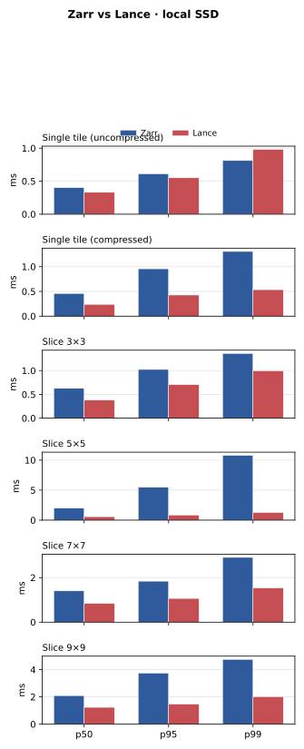
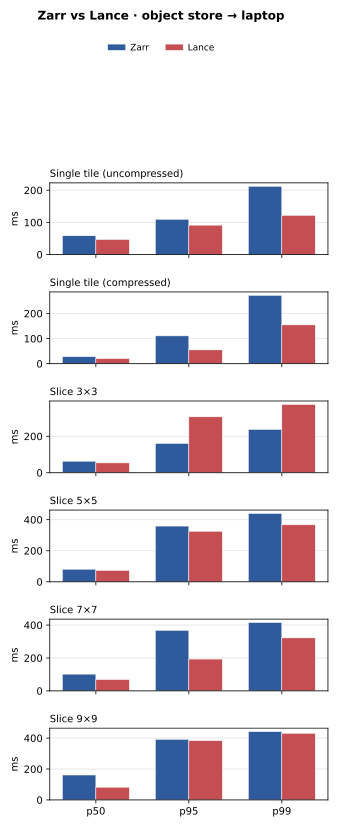

# lance-array

**lance-array** is chunk-aligned **2D arrays** on **Lance**.

- One row per tile; payloads are stored in **raw** or **Blosc**-compressed bytes.
- Chunks are written in **Morton** ordering so spatially contiguous tiles are near each other (same idea as Zarr).
- Object-store-friendly IO and **NumPy**-style slicing—**one physical chunk at a time**.
- Tabular metadata plus chunk bytes in Lance plays the same role as Zarr’s manifest plus chunk files.
- Lance handles **versioning**, **eager prefetching**, **pushdown filtering** on non-bytes columns, and unified storage.

**Lance blobs** • **Zarr-like reads** • **Built-in codecs** (raw, numcodecs Blosc, Blosc2 via optional `zarr` extra) • **Benchmarks** vs Zarr 3

`TileCodec` covers **raw**, **numcodecs Blosc**, and **Blosc2** (via the `zarr` extra). This is **not** a full Zarr codec pipeline or n-dimensional store; it targets **2D** rasters and fair comparison with **Zarr 3** in the benchmark scripts.

## Quick start

```python
import numpy as np
import lance_array as la
from lance_array import LanceArray, TileCodec

image = np.zeros((2048, 2048), dtype=np.uint16)

LanceArray.to_lance(
    "path/to/array.lance",
    image,
    chunk_shape=(256, 256),
    codec=TileCodec.RAW,
)

view = la.open_array("path/to/array.lance", mode="r")
window = view[10:100, 5:200]       # batched read + stitch
full = view.to_numpy()             # whole raster

rw = la.open_array("path/to/array.lance", mode="r+")
rw[10:100, 5:200] = window         # merge-insert per overlapping tile
```

Reads mirror `zarr.open_array(..., mode="r")` + slicing; writes are intentionally narrower (basic indices only). Each dataset includes `lance_array.json` so `open_array()` / `LanceArray.open()` can restore shape, chunks, dtype, and codec.

## Zarr vs `LanceArray`

**Zarr 3** — open and slice; intersecting chunks are read and returned as NumPy.

```python
import numpy as np
import zarr

z = zarr.open_array("path/to/array", mode="r")
tile = np.asarray(z[0:256, 256:512], dtype=np.uint16)
```

**`LanceArray`** — one row per tile. Reads use NumPy/Zarr-style indexing: overlapping tiles are fetched in batch (`take_blobs`), decoded, and stitched (including partial windows and strided slices).

```python
import numpy as np
import zarr
import lance_array as la
from lance_array import LanceArray, TileCodec

image = np.zeros((2048, 2048), dtype=np.uint16)

# RAW, BLOSC_NUMCODECS (core), BLOSC2 (install blosc2 → use `zarr` extra)
LanceArray.to_lance(
    "path/to/array.lance",
    image,
    chunk_shape=(256, 256),
    codec=TileCodec.RAW,
)

z = zarr.open_array("path/to/array.zarr", mode="r")
view = la.open_array("path/to/array.lance", mode="r")

ch0, ch1 = view.chunks  # same idea as z.chunks

window = view[10:100, 5:200]
# zarr: np.asarray(z[10:100, 5:200], dtype=z.dtype)

tile = view[0:ch0, ch1 : 2 * ch1]
pixel = view[12, 34]  # 0-d ndarray
full = view.to_numpy()
# zarr: np.asarray(z[:], dtype=z.dtype)

np.asarray(view[0:ch0, 0:ch1], dtype=view.dtype)
```

**Writes** use Lance [merge insert](https://lance.org/guide/read_and_write/#bulk-update) on `(i, j)` tile keys. Use **`mode="r+"`** and **basic** indices only (`int` or `slice` with step `1`), with NumPy broadcasting for the RHS. Fancy integer, boolean, and strided **assignment** are not supported (use `LanceArray.to_lance` for a full raster replace).

```python
rw = la.open_array("path/to/array.lance", mode="r+")
rw[10:100, 5:200] = window  # read–modify–encode–merge per overlapping tile
```

## Slicing vs Zarr / NumPy (2D)

| | **Zarr 3** | **`LanceArray`** |
|---|------------|------------------|
| `int` / `slice` (step **1**) | Yes | Yes — `take_blobs`, then stitch |
| Slice step ≠ 1 | Yes | Yes — bounding box read, stride in memory |
| `...`, row-only (`view[i]`), `np.ix_` | Yes | Yes |
| Fancy integer / boolean | Zarr varies | Yes — NumPy-style 2D rules |
| Whole raster | `np.asarray(z[...])` | `view.to_numpy()` or `view[:, :]` |
| Write via `[]` | Yes | `mode="r+"` — basic indices only |

Reads decode every tile that intersects the index (fancy reads may widen the window). Writes batch merge updates per assignment. Design notes: [`prds/`](https://github.com/slaf-project/lance-array/tree/main/prds) on GitHub.

## Repository layout

| Path | Purpose |
|------|---------|
| `lance_array/` | Package; logic in `core.py` |
| `prds/` | Product notes (e.g. slice writes, `r+`) |
| `scripts/create_benchmark_datasets.py` | `test.zarr` / `test.lance` from JPG; `--full` → `.bench_out/` |
| `scripts/run_benchmark.py` | Timed reads; `--full` for all variants |
| `scripts/render_benchmark_charts.py` | SVG charts from `local_summary.txt` / `s3_summary.txt` |
| `scripts/sample_2048.jpg` | Sample raster; script can fetch if missing |
| `modal_app.py` | [Modal](https://modal.com/) entrypoint — remote S3-only benchmark (`modal run modal_app.py`) |

## Development

```bash
git clone https://github.com/slaf-project/lance-array.git
cd lance-array
uv sync
```

| Extra | Purpose |
|-------|---------|
| `zarr` | Zarr 3, Blosc2, Pillow — benchmarks |
| `dev` | pytest, ruff, coverage, typing |
| `docs` | MkDocs, Material, mkdocstrings |
| `cloud` | `smart-open[s3]`, `s3fs` — remote URIs and S3 benchmarks |
| `modal` | Modal — run the S3 benchmark on a remote CPU |

```bash
uv sync --extra dev --extra zarr
uv run pytest
```

## Building these docs locally

```bash
uv sync --extra docs
uv run mkdocs serve
```

## Benchmark

Scripts under `scripts/` build aligned Zarr 3 and Lance datasets from `scripts/sample_2048.jpg`, then time random single-chunk reads and a batched replay pattern. `test.zarr/`, `test.lance/`, and `.bench_out/` are gitignored. **Chunk size is 64×64** (see `create_benchmark_datasets.py` if you change it).

```bash
uv sync --extra dev --extra zarr
uv run python scripts/create_benchmark_datasets.py
uv run python scripts/run_benchmark.py
# Full five-way table:
uv run python scripts/create_benchmark_datasets.py --full
uv run python scripts/run_benchmark.py --full
# Same suite on object storage (needs --extra cloud; 100 reads in S3 mode):
# uv run python scripts/run_benchmark.py --full --s3
```

**Modal (remote S3 only).** Create a Modal secret **`s3-credentials`** with your Tigris/S3 env (`modal_app.py` wires it in). Then:

```bash
uv sync --extra modal
modal run modal_app.py
```

Optional env: `S3_BENCHMARK_PREFIX`, `S3_BENCHMARK_ENDPOINT_URL` (see `modal_app.py`).

### Environment (representative run)

| | |
|--|--|
| Date | 2026-03-23 |
| Machine | Apple M1 Max, 32 GB RAM |
| OS | macOS 26.0.1 (Tahoe) |
| Python | 3.12.10 |
| `zarr` | 3.1.5 |
| `zarrs` ([zarrs-python](https://github.com/zarrs/zarrs-python), Rust codec pipeline) | 0.2.2 |
| `lance` (PyPI `pylance`) | 3.0.1 |

### Full-suite latency (p50 / p95 / p99)

The `run_benchmark.py --full` tables report **per-request** latencies. **Means** are easy to skew (e.g. first read / cold cache), so the charts use **p50 / p95 / p99** on a **shared x-axis**; each **horizontal facet** is one condition (single tile uncompressed/compressed, then each slice size). **Zarr** and **Lance** are paired bars per percentile; **y** is comparable across p50–p99 within each facet. Captions for methodology and data source are **below each figure**. Generated from captured benchmark output:

- [`scripts/local_summary.txt`](https://github.com/slaf-project/lance-array/blob/main/scripts/local_summary.txt) — SSD → laptop  
- [`scripts/s3_summary.txt`](https://github.com/slaf-project/lance-array/blob/main/scripts/s3_summary.txt) — object store (e.g. Tigris) → laptop  

Regenerate SVGs after updating those files:

```bash
uv sync --extra dev
uv run python scripts/render_benchmark_charts.py
```

**Labels.** **Lance uncompressed (Morton order)** is **raw** payload (no Blosc2)—only **Morton (Z-order) tile sequencing** in the Lance table. **Lance compressed (Blosc2 + Morton)** is Blosc2-compressed tiles with the same Morton ordering.



*Caption — **local SSD → laptop**:* Per-request latency; **means omitted** (often skewed by cold starts). **Batched + replay** not shown. **Single tile (uncompressed):** Zarr row-major chunk order vs Lance **raw** payload and **Morton (Z-order)** tile rows. **Single tile (compressed)** and **slices:** Zarr **numcodecs Blosc** vs Lance **Blosc2** with the same Morton ordering. Slices use every N×N row from the compressed scaling table. Source: [`scripts/local_summary.txt`](https://github.com/slaf-project/lance-array/blob/main/scripts/local_summary.txt).



*Caption — **object store → laptop**:* Same layout and comparisons as above. Source: [`scripts/s3_summary.txt`](https://github.com/slaf-project/lance-array/blob/main/scripts/s3_summary.txt).

### Benchmark notes and learnings

- Detailed March 2026 write-up: [Random Access Learnings (March 2026)](blog/random-access-learnings-2026-03.md)

## API reference

- [Core API](api/core.md) — `LanceArray`, `TileCodec`, `open_array`, `normalize_chunk_slices`

## Acknowledgments

- [Lance](https://lance.org/) — columnar, versioned datasets and blob columns on object storage
- [Zarr](https://zarr.dev/) — chunked, compressed N-D arrays and the read model this library follows

## License

Apache-2.0 — see [LICENSE](https://github.com/slaf-project/lance-array/blob/main/LICENSE).
